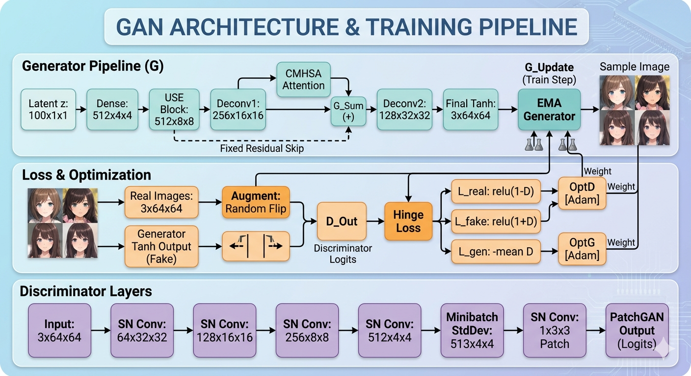

# Automatic Anime Character Generation using GANs

## Overview
This project presents **USE-CMHSA GAN**, an advanced Generative Adversarial Network (GAN) architecture for high-quality anime face generation. The model enhances traditional DCGAN architectures using custom attention mechanisms and stabilization techniques to generate realistic and diverse anime character images.

The project also includes an interactive **Gradio-based web interface** for real-time anime face generation.

---

## Features
- High-quality anime face generation using GANs
- Custom **USE (Upsample Squeeze-Excitation)** block
- Custom **CMHSA (Convolutional Multi-Head Self-Attention)** block
- Spectral Normalization for stable GAN training
- Minibatch Standard Deviation to reduce mode collapse
- Hinge Loss for improved adversarial learning
- EMA (Exponential Moving Average) generator weights
- Interactive Gradio interface
- FID and Inception Score evaluation support

---

## Architecture

<p align="center">
  
</p>

The proposed USE-CMHSA GAN architecture integrates custom USE and CMHSA attention modules to improve feature representation, spatial dependency learning, and overall image quality during anime face synthesis.

---

## Technologies Used
- Python 3.x
- PyTorch
- Torchvision
- Torchmetrics
- Torch-fidelity
- Gradio
- NumPy
- Matplotlib
- PIL (Pillow)

---

## Dataset
The model is trained on the **Anime Face Dataset** from Kaggle.

Dataset Link:
https://www.kaggle.com/datasets/splcher/animefacedataset

### Dataset Details
- ~63,000+ anime face images
- RGB images
- Images resized to 64×64 during preprocessing


---

## Installation

### Clone the Repository

```bash
git clone [<repository-url>](https://github.com/RohiniShankari/Automatic-Anime-Character-Generation-using-GANs.git)
cd Automatic-Anime-Character-Generation-using-GANs
```

### Install Dependencies

```bash
pip install -r requirements.txt
```

Or install manually:

```bash
pip install torch torchvision torchmetrics torch-fidelity gradio matplotlib pillow numpy tqdm
```

---

## Training the Model

### Train Optimized USE-CMHSA GAN

```bash
Optimized-USE-CMHSA-GAN-for-Anime-Face-Generation/uc gan/optimizeddiscriminatormodel/train.py
```


## Running the Gradio Interface

```bash
Optimized-USE-CMHSA-GAN-for-Anime-Face-Generation/uc gan/optimizeddiscriminatormodel/interface.py
```

The interface allows users to:
- Generate multiple anime faces
- Use optional conditioning vectors
- Download generated outputs

---

## Evaluation

Run FID and Inception Score evaluation:

```bash
Optimized-USE-CMHSA-GAN-for-Anime-Face-Generation/uc gan/optimizeddiscriminatormodel/run_all.py
```

### Metrics Used
- Frechet Inception Distance (FID)
- Inception Score (IS)

---

## Generated Results

<p align="center">
  
</p>

The optimized USE-CMHSA GAN generates high-quality and diverse anime faces with improved visual consistency and reduced mode collapse.

---

## Performance Metrics


| Model | Full FID |
|------|------|
| DCGAN Baseline | 162 |
| USE-CMHSA GAN | 67 |
| Optimized USE-CMHSA GAN | 38.75 |

The optimized model significantly improves image quality and training stability compared to the baseline DCGAN architecture.

---

## Key Improvements
- Better facial feature consistency
- Improved image diversity
- Stable GAN convergence
- Reduced mode collapse
- Enhanced spatial attention learning

---

## Future Scope
- Higher resolution image generation (128×128 / 256×256)
- Conditional anime generation
- Text-to-image integration using CLIP
- Diffusion-GAN hybrid models
- Video anime generation
- Mobile/edge deployment optimization

---

## References
1. GANs — Goodfellow et al.
2. DCGAN — Radford et al.
3. Spectral Normalization — Miyato et al.
4. SAGAN — Zhang et al.
5. StyleGAN — Karras et al.

---

## Authors
- B. Rohini Sankari
- M. Lilly
- N. Pranavi
- J. Yaswitha
- B. Gowthami Bai

---

## Acknowledgement
Special thanks to the Department of Computer Science and Engineering, RGUKT Nuzvid, and project guide Mrs. N. Swathi for continuous guidance and support throughout the project.
